# 
Image Captioning

## Table des matières

- [Image Captioning](#image-captioning)
  - [Table des matières](#table-des-matières)
  - [I. Introduction](#i-introduction)
  - [II. Choix du modèle](#ii-choix-du-modèle)
  - [III. Choix du dataset](#iii-choix-du-dataset)
  - [IV. Entraînement et validation](#iv-entraînement-et-validation)
  - [V. Test](#v-test)
  - [VI. Ajustement des hyperparamètres](#vi-ajustement-des-hyperparamètres)
  - [VII. Préconisation](#vii-préconisation)

## I. Introduction

Pour notre sujet, nous avions envie de mélanger plusieurs types de modèles. Si l'idée était au départ de partir d'une description pour générer une image, nous avons choisi d'être réaliste et de nous tourner vers de la description d'images.
Au delà de son utilité pour les personnes mal-voyantes, la description d'image pourra trouver d'autres utilités, notamment dans le milieu du tourisme où l'on peut imaginer l'utilisation d’IA pour remplacer les plaques aux points d’intérêts touristiques, souvent disponible seulement dans une ou deux langues.

L'intérêt de ce projet reste tout de même basé sur l'apport de compétences qu'il représente car il se base sur l'utilisation de deux modèles à la suite et demande donc cette double implémentation. Il nous permet à la fois de toucher à un modèle plutôt sur l'image, et un plutôt sur le texte. C'est donc un sujet qui nous a semblé pertinent dans le cadre de ce projet.

## II. Choix du modèle

## III. Choix du dataset

Initialement, le choix de notre dataset s'était porté sur un dataset disponible sur Huggingface : https://huggingface.co/datasets/yuvalkirstain/pexel_images_lots_with_generated_captions. Ce jeu de données comporte 7999 photos normalisées qui font toutes 512x512 accompagnées de leur description, une simplicité de téléchargement grâce au package datasets et les images semblaient toutes de bonne qualité.
Cependant, certaines des descriptions avaient été générées automatiquement (descriptions n'ayant pas de sens ou avec des répétitions de mots) et les images étant principalement des portraits nous n'étions pas sûrs d'utiliser ce dataset.

Le dataset proposé avec le tutoriel s'est avéré être beaucoup plus diversifié, et proposer un nombre d'images bien plus importants dont les descriptions semblaient avoir été annotées manuellement. Sachant que notre code était déjà rédigé pour ce dataset, nous avons décidé de le garder. Nous avons limité sa taille (32 000) et l'avons séparé en test (70%), validation (12%) et test (18%) pour garder toujours un nombre d'images divisible par 32.

Lorsque l'on s'intéresse aux images, on trouve globalement des images de bonne qualité, avec beaucoup d'humains. Il y a une présence accrue de chiens comparés aux autres animaux. Les décors proposés sont assez diversifiés mais l'on retrouve tout de même beaucoup la montagne et la mer.

    <figure>
        <figcaption>Images tirées aléatoirement de la base de test</figcaption>
        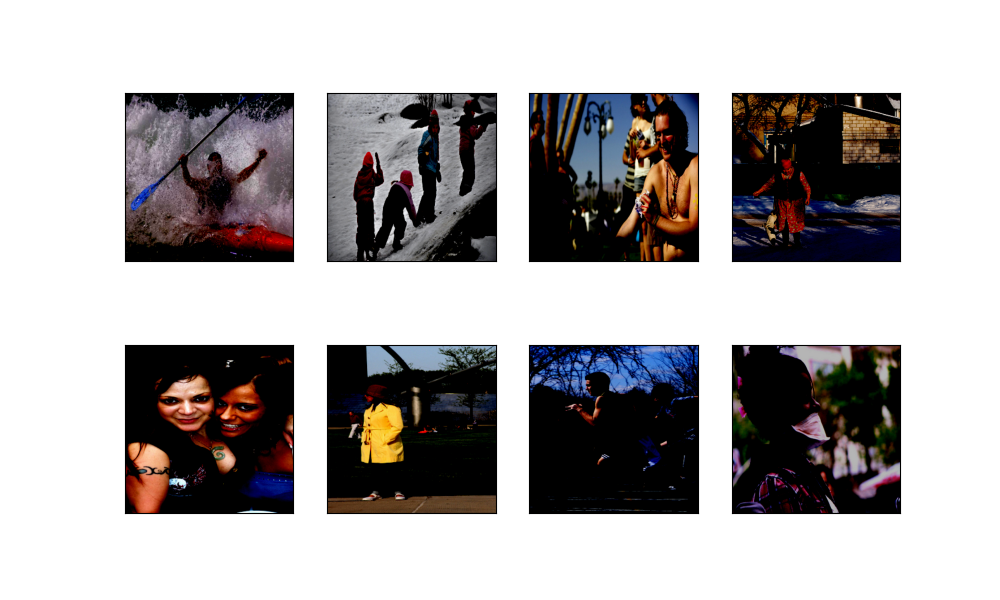
    </figure>

On s'est également intéressé au contenu des descriptions, pour cela on a affiché les 100 mots les plus fréquents dans le dataset (en excluant les mots les plus courant de la langue anglaise) et on trouve cette liste :

    <figure>
        <figcaption>33 mots les plus utilisés dans les descriptions.</figcaption>
        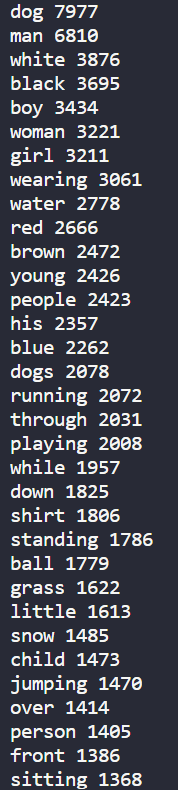
        
    </figure>

La liste suivante a été réalisée de manière similaire en prenant les associations de deux mots consécutifs (toujours en excluant les mots courants du langage), puis avec trois mots consécutifs :

    <figure>
    <figcaption>Suites de deux mots les plus utilisés dans les descriptions.</figcaption>
    </figure>
        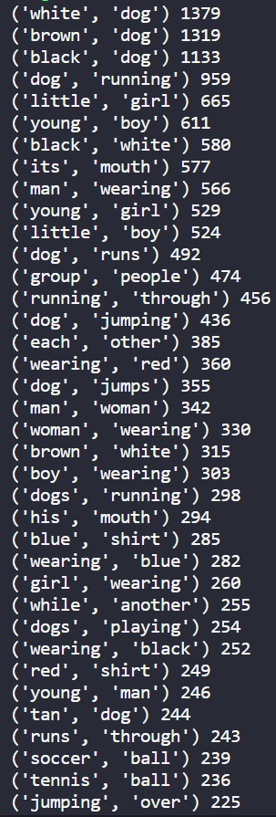
    <figure>
        <figcaption>Suites de trois mots les plus utilisés dans les descriptions.</figcaption>
        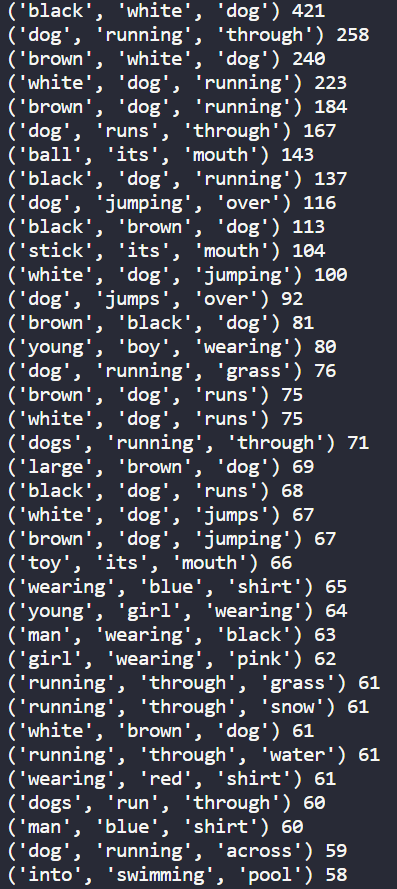   
    </figure>

Ces listes seront utiles pour interpreter les résultats obtenus au moment de la phase de test du modèle.

## IV. Entraînement et validation

## V. Test

Pour analyser le test nous allons nous intéresser à des exemples testés sur le modèle entraîné avec 40 epochs.

Tout d'abord, nous avons choisi de tester le modèle sur des images trouvées sur Internet pour voir ses performances sur des images n'appartenant pas au dataset de test.

    <figure>
        <figcaption>Exemple 1 : a man is standing on a rock overlooking a lake.</figcaption>
        
    </figure>  
    <figure>
        <figcaption>Exemple 2 : a man in a red shirt and black pants is sitting on a bench.</figcaption>
        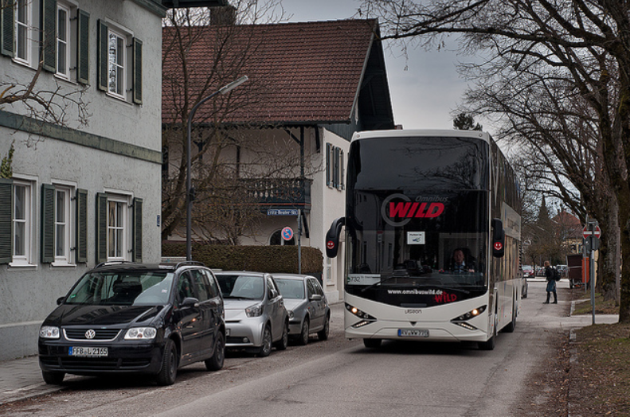
        </figure>  
    <figure>
        
        <figcaption>Exemple 3 : a little girl in a pink shirt is walking on a sidewalk.</figcaption>
    </figure>  
    <figure>
        <figcaption>Exemple 4 : a dog is running through the water.</figcaption>
        
    </figure>  
    <figure>
        <figcaption>Exemple 5 : a man is standing on a rock overlooking a lake.</figcaption>
        
    </figure> 

On se rend très rapidement compte que le modèle n'est pas performant sur ces images. On trouve sur deux images la même description alors que les images ne sont absolument pas les mêmes (exemples 1 et 5). Le modèle ne mentionne ni le bus ni le bateau, il ne reconnaît pas non plus le cheval.
Les exemples 3 est moins mauvais, on peut s'attendre à ce que le modèle ne fasse pas la différence entre une petite fille et un petit garçon, mais remplacer "jouer avec un Frisbee" par marché sur le trottoir montre des difficultés d'analyse du contexte au delà du sujet central de l'image.
L'exemple 4 est bon puisque si le mot "through" était remplacé par near la description serait correcte. Cette erreur peut facilement s'expliquer par le fait que through apparaisse dans les exemples courants mais pas near.

Pour ces images, on a donc l'intuition que le modèle va être plus performant sur les humains et les chiens, et va avoir des difficultés à décrire leur environnement. Et pour cause, notre base d’entraînement présente un nombre très important d'humain et de chiens. En plus de cela les description de leurs environnements sont au final assez sommaires et on a plus tendance à s'intéresser à leurs actions.
Et quand le modèle n'arrive pas à identifier un élément bien connu, il va créer une phrase générique à partir d'un élément. L'exemple 1 présente un lac, il va donc chercher à broder autour de cela. Au final lorsqu'il brode pour l'exemple 5 il se base sur un homme sur un caillou et il va parvenir à la même phrase générique.

Intéressons nous maintenant aux images présentent dans la base de test, qui vont donc être issues du même dataset :

    <figure>
        <figcaption>Exemple 6 : A man wearing a orange vest is canoeing in the blue water.</figcaption>
        <figcaption>Prediction : a man in a red jacket is standing on a rock overlooking a lake.</figcaption>
        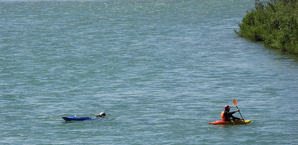
    </figure>
    <figure>
        <figcaption>Exemple 7 : The men are in a rocky mountain area.</figcaption>
        <figcaption>Prédiction : a man in a red shirt is standing on a rock ledge with his arms outstretched.</figcaption>
        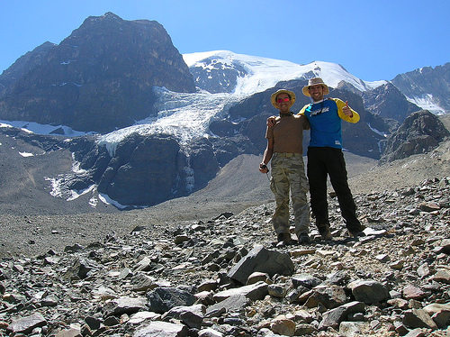
    </figure>
    <figure>
        <figcaption>Exemple 8 : A little girl smiles as she wears a white bowl on the top of her head.</figcaption>
        <figcaption>Prédiction : a young boy is playing with a toy car.</figcaption>
        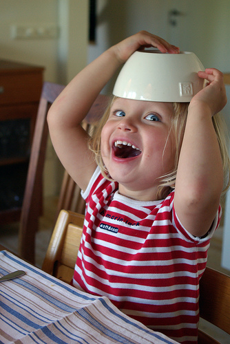
    </figure>
    <figure>
        <figcaption>Exemple 9 : A Beagle dog is walking on the shoreline at the beach.</figcaption>
        <figcaption>Prédiction : a dog is running through the water.</figcaption>
        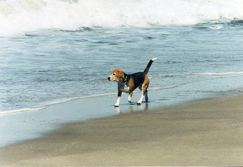
    </figure>
    <figure>
        <figcaption>Exemple 10 : Two brown dogs are playing with a red ball.</figcaption>
        <figcaption>Prédiction : a dog is running through a field of grass.</figcaption>
        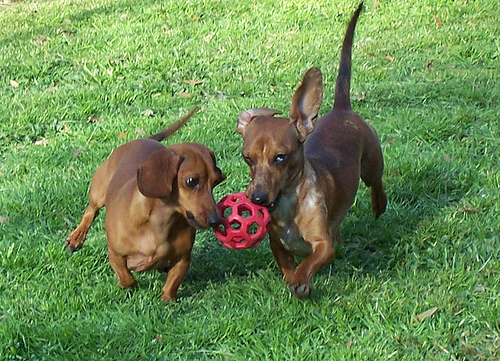
    </figure>
    <figure>
        <figcaption>Exemple 11 : A woman in a brown jacket is standing on a rock with a forested background.</figcaption>
        <figcaption>Prédiction : a man in a red jacket is standing on a rock ledge with his arms outstretched.</figcaption>
        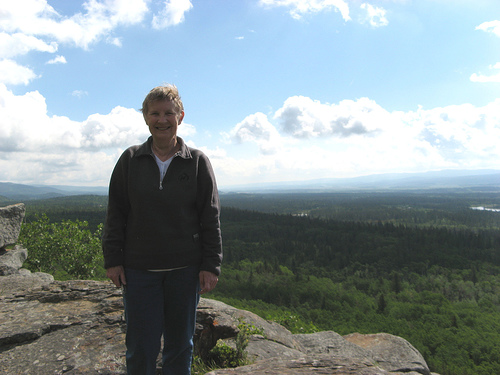
    </figure>

L'exemple 6 confirme notre intuition de phrase générique brodée autour d'un ou deux éléments puisqu'on retrouve la phrase "standing on a rock overlooking a lake" mais cette fois avec le détail de la couleur orange du kayak et du gilet qui amène la nuance "in a red jacket". Le modèle ne reconnaît toujours pas de "moyen" de transport et ne mentionne pas le kayak.

L'exemple 7 est une bonne démonstration du fait que la base d’entraînement présente beaucoup plus de personnes seules que de groupes de personnes. On voit également que la couleur la plus représentée en association avec les vêtements est le rouge puisque c'est encore cette couleur qui revient quand on parle d'homme. Le reste de la description est plutôt pertinent.

L'exemple 8 est très intéressant pour la manière dont le modèle va interpréter les détails. L'enfant est identifié comme "young boy" qui est l'association de deux mots la plus courante pour parler d'enfants. Playing étant un mot très utilisé dans la base de données il n'est pas étonnant de retrouver ce concept associé à un enfant, cependant le fait que le modèle mentionne une petite voiture alors que cette association n'est pas dans les plus courante laisse penser qu'il a pu percevoir la nappe et la cuillère comme un circuit de voiture et le jouet allant avec. On n'a donc ici pas une phrase générique mais une vraie tentative d'interprétation de l'environnement de la photo.

L'exemple 9 présente la même situation que l'exemple 4, de la section précédente, au lieu d'avoir un chien près de l'eau, on a un chien qui courre à travers l'eau. Cela s'explique par les fortes associations entre "dog" et "running" et entre "running" et "thought". Comme le modèle a identifié l'ocean, il sait que la suite sera "water". On obtient donc comme ça une prédiction presque correcte.

L'exemple 10 montre à nouveau les difficultés du modèle à générer des pluriels et à relever les détails. Le contexte général de l'herbe est pris en compte sans problème mais il n'arrive pas à identifier le jouet dans la bouche des chiens malgré le fait que les associations de 2 et 3 mois les plus courantes présente assez souvent cette idée. On remarque aussi que là où le modèle aime beaucoup donner la couleur rouge aux vêtements, il ne donne pas la couleur des chiens, sûrement parce qu'il n'y a pas de couleur associée au mot chien qui se démarque des autres.

L'exemple 11 marque le fait qu'il y presque deux fois plus d'exemples d'hommes dans la base de donnée, il n'arrive donc pas à identifier le fait que le sujet est une femme. Pour ce qui est du reste, on voit qu'il identifie à nouveau un massif rocheux et le fait que les bras de la personne sont tendus le long du corps, fait qu'il interprète comme "outstretched".

La valeur de la loss de test du modèle est de t_loss = 0.10472098249528143. On s'attendrait donc à avoir des exemples plus précis que ça lorsque l'on regarde ce que le modèle produit en détail mais ça n'est pas nécessairement le cas. Il nous semble donc que notre modèle est un peu trop confiant dans ses capacités.
Nous sommes quand même assez satisfaits des résultats de notre modèle sur les images issues de la base de test. On trouve dans la plupart des exemples des informations pertinentes sur le sujet central et son environnement. Notre modèle est capable de donner le contexte des images qu'on lui donne et tire ses principaux défauts de la répétition d'associations de mots trop courantes.

## VI. Ajustement des hyperparamètres

## VII. Préconisation
