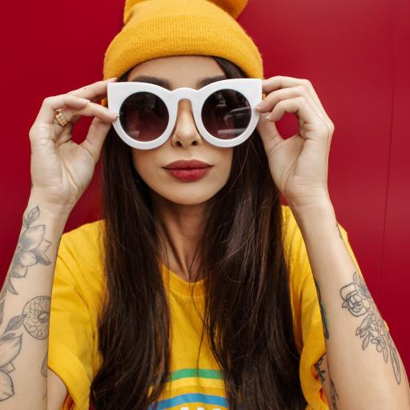

# Generation de description d'image.

## Choix de la base de données :

Database Hugging face contenant 7999 éléments, majoritairement des portraits d'humains, mais également quelques portraits d'animaux. La base ne fournit que du train, nous ferons donc initialement de la cross-validation, puis nous chercherons peut-être par la suite une base de test.

Exemple d'image de la base de données :

Dont la description est : "portrait of a woman wearing a yellow beanie hat and sunglasses, holding a pair of white sunglasses".

## Choix de la méthode d'entrainement du modèle

### Besoin d'extraire les features de l'image

Création de notre propre CNN pour extraire les features de l'image et fournir du texte à un modèle NLP.

### Choix du modèle de NLP

Choix d'un GPT plutôt qu'un BERT car pas de nécessité de classification.

## Avancée du projet

### Samedi 2 décembre :

Mise en marche du projet. Début du travail sur notre CNN.

### Lundi 4 décembre :

Choix de plutôt s'orienter vers un CNN de visual encoding suivi par un LSTM pour le captionning.
L'idée sera d'enlever la dernière étape du CNN pour y ajouter ce qui nous intéresse et ensuite le brancher sur le LSTM pour obtenir la description de l'image.

Pour le début du projet, nous nous basons sur cette vidéo. Nous verrons ensuite pour remplacer le LSTM par un GPT.

https://www.youtube.com/watch?v=y2BaTt1fxJU
