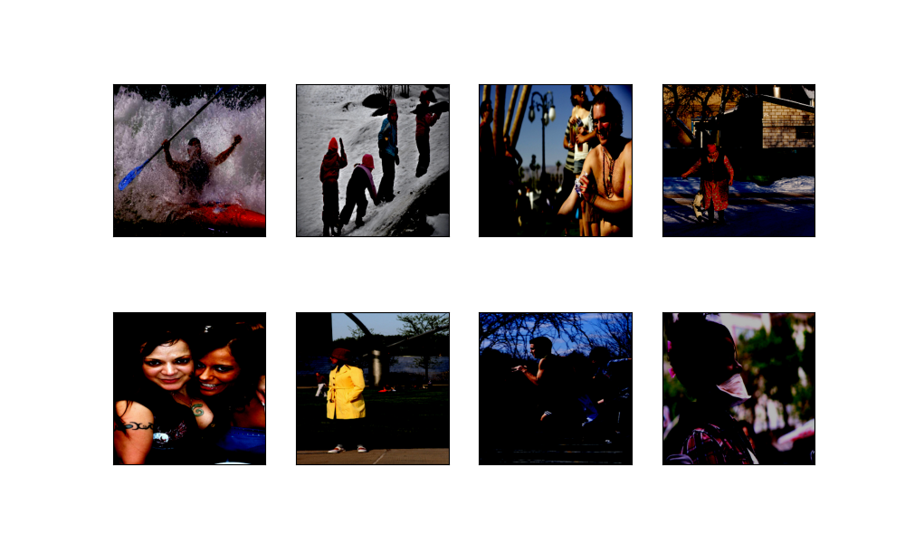
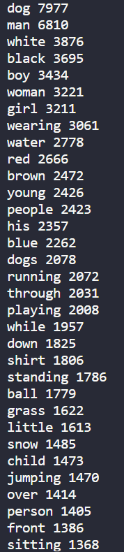
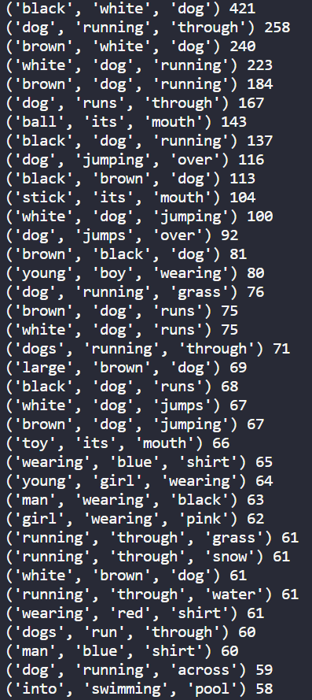
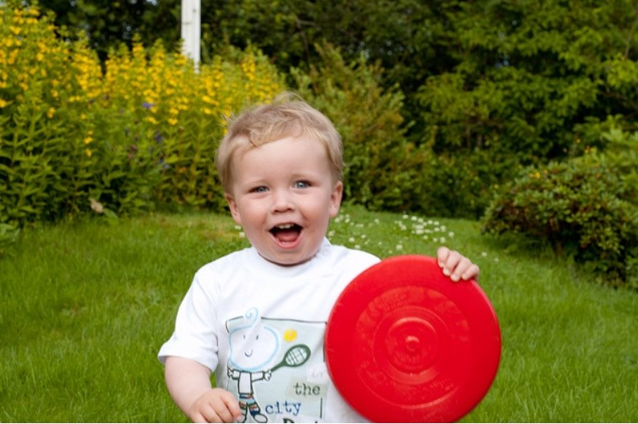

# 
Image Captioning

## Table des matières

- [Image Captioning](#image-captioning)
  - [Table des matières](#table-des-matières)
  - [I. Introduction](#i-introduction)
  - [II. Choix du modèle](#ii-choix-du-modèle)
  - [III. Choix du dataset](#iii-choix-du-dataset)
  - [IV. Entraînement et validation](#iv-entraînement-et-validation)
  - [V. Test](#v-test)
  - [VI. Ajustement des hyperparamètres](#vi-ajustement-des-hyperparamètres)
  - [VII. Préconisations](#vii-préconisations)

## I. Introduction

Pour notre sujet, nous avions envie de mélanger plusieurs types de modèles. Si l'idée était au départ de partir d'une description pour générer une image, nous avons choisi d'être réaliste et de nous tourner vers de la description d'images.
Au delà de son utilité pour les personnes mal-voyantes, la description d'image pourra trouver d'autres utilités, notamment dans le milieu du tourisme où l'on peut imaginer l'utilisation d’IA pour remplacer les plaques aux points d’intérêts touristiques, souvent disponible seulement dans une ou deux langues.

L'intérêt de ce projet reste tout de même basé sur l'apport de compétences qu'il représente car il se base sur l'utilisation de deux modèles à la suite et demande donc cette double implémentation. Il nous permet à la fois de toucher à un modèle plutôt sur l'image, et un plutôt sur le texte. C'est donc un sujet qui nous a semblé pertinent dans le cadre de ce projet.

## II. Choix du modèle

Nous avons choisi d'utiliser une combinaison d'un réseau de convolution CNN qui prépare les embeddings à fournir à un modèle de NLP. En nous inspirant du projet github suivant : https://github.com/aladdinpersson/Machine-Learning-Collection/tree/master/ML/Pytorch/more_advanced/image_captioning créé par l'utilisateur aladdinpersson, nous avons décidé de réaliser cette partie NLP par la mise en place d'un réseau de LSTM (Long Short Term Memory).

Ainsi notre projet consiste à la fois à fine-tune un CNN performant pour construire des embeddings d'images qui pourront être réutilisés par un modèle NLP, et à entraîner ce nouveau modèle constitué d'un LSTM puis d'une couche linéaire pour générer des descriptions d'images. Cette dernière couche linéaire a pour but de choisir le token (ou mot) le plus probable à partir de la séquence d'embeddings fournie par le LSTM.

<figure>

<label>Schématisation du fonctionnement de notre modèle</label>

</figure>

Décrivons plus en détail le fonctionnement de notre modèle. Tout d'abord, les images sont transformées au moment de la conception des dataloaders pour avoir mêmes dimensions et propriétés indépendamment du format d'origine (en particulier on veut pouvoir traiter des png et des jpg sans distinction). Les images sont alors converties en tenseurs et normalisées. On forme ensuite les batchs d'images avec leurs descriptions associées en utilisant la fonction get_loader que nous avons implémentée. Elle a été spécifiquement conçue pour notre jeu de données qui s'organise en un dossier contenant les images et un fichier texte au format csv 2 colonnes contenant les descriptions et le path des images correspondantes. Dans le cadre de ce projet, nous avons pris l'initiative de répartir les données en base d'entraînement, de validation et de test avec respectivement 70%, 15% et 15% des données.

Nous avions initialement prévu de réaliser de la data augmentation notamment en faisant varier la rotation des images et la luminosité. Cependant, ces choix ne nous ont finalement pas parus pertinents car ils ne sont pas représentatifs des applications réelles potentielles du projet et au lieu de régulariser le modèle, ils ont eu tendance à le dégrader dans les premières phases de tests. La seule forme de data augmentation que nous avons finalement conservé est de rogner aléatoirement les images de format 356 par 356 pixels en un carré de 299 par 299 pixels. Nous garantissons ainsi que le modèle ne soit pas trop sensible à la position de l'objet dans l'image. Par exemple, si à notre insu les images ayant des chiens dans le dataset les représentent toujours dans la partie gauche de l'image, ce cropping aléatoire permettrait de recentrer cette position sur certaines images lorsque c'est la partie droite qui est rognée. On contribue ainsi à rendre notre modèle plus robuste avec des inputs plus petits sans perte de performance notable.

Pour pouvoir plus tard calculer une loss par CrossEntropy en sortie du LSTM, il faut dès la création des dataloaders représenter les descriptions sous forme de tenseurs contenant la séquence des tokens. Pour cela, nous avons conçu une classe Vocabulary qui permet de construire un vocabulaire à partir des descriptions du jeu de données. Tout token (symbolisant environ une syllabe) est représenté par un entier.

<figure>

<label>Représentation du modèle Inception V3</label>

</figure>

Une fois les dataloaders et le vocabulaire créés, le pre-processing est terminé : on dispose des batchs d'inputs à donner au modèle (avec leurs labels). Développons donc plus en détail le modèle à proprement dit, à commencer par le CNN pré-entraîné. Le modèle que nous allons fine-tune est InceptionV3, un réseau de convolution très performant qui a été pré-entraîné sur ImageNet. Ses résultats sur le corpus dépassent 78,1% de précision avec "seulement" 24 millions de paramètres. Il est donc plus performant que le modèle usuel resnet50 et beaucoup moins coûteux que les modèles ayant des performances à peine supérieures comme resnet152. La figure suivante permet de comparer divers modèle de classification d'image et leur précision sur le corpus ImageNet. Les meilleurs modèles sont dans le coin supérieur gauche (bonne précision, peu de paramètres).

<figure>

<label>Comparaison des performances de différents modèles de classification d'images</label>

</figure>

Pour l'adapter à notre tâche et faire du fine-tuning, on remplace la partie fully connected (MLP) permettant la classification en fin de modèle par une unique couche linéaire dont le but est de produire à partir du feature vector (synthèse vectorielle de l'ensemble des représentations finales des inputs dans le modèle au sortir de la dernière convolution) des embeddings de la taille souhaitée pour le LSTM (la taille du vocabulaire).

Ces embeddings sont ensuite passés dans un LSTM qui va générer une nouvelle séquence de même dimension que le vocabulaire. Enfin, une couche linéaire permettra de prédire le token le plus probable à partir de cette séquence d'embeddings.

Le modèle est entraîné par backpropagation et descente stochastique avec une loss par CrossEntropy (puisqu'on fait à chaque élément de la séquence / du descriptif une classification sur le bon token du langage). En plus de la SGD, la régularisation du modèle est assurée par un Dropout sur les couches linéaires et sur les embeddings en entrée du LSTM.

## III. Choix du dataset

Initialement, le choix de notre dataset s'était porté sur un dataset disponible sur Huggingface : https://huggingface.co/datasets/yuvalkirstain/pexel_images_lots_with_generated_captions. Ce jeu de données comporte 7999 photos normalisées qui font toutes 512x512 accompagnées de leur description, une simplicité de téléchargement grâce au package datasets et les images semblaient toutes de bonne qualité.
Cependant, certaines des descriptions avaient été générées automatiquement (descriptions n'ayant pas de sens ou avec des répétitions de mots) et les images étant principalement des portraits nous n'étions pas sûrs d'utiliser ce dataset.

Le dataset proposé avec le tutoriel s'est avéré être beaucoup plus diversifié, et proposer un nombre d'images bien plus importants dont les descriptions semblaient avoir été annotées manuellement. Sachant que notre code était déjà rédigé pour ce dataset, nous avons décidé de le garder. Nous avons limité sa taille (32 000) et l'avons séparé en test (70%), validation (15%) et test (15%).

Lorsque l'on s'intéresse aux images, on trouve globalement des images de bonne qualité, avec beaucoup d'humains. Il y a une présence accrue de chiens comparés aux autres animaux. Les décors proposés sont assez diversifiés mais l'on retrouve tout de même beaucoup la montagne et la mer.

    <figure>
        <figcaption>Images tirées aléatoirement de la base de test</figcaption>
        
    </figure>

On s'est également intéressé au contenu des descriptions, pour cela on a affiché les 100 mots les plus fréquents dans le dataset (en excluant les mots les plus courant de la langue anglaise) et on trouve cette liste :

    <figure>
        <figcaption>33 mots les plus utilisés dans les descriptions.</figcaption>
        
        
    </figure>

La liste suivante a été réalisée de manière similaire en prenant les associations de deux mots consécutifs (toujours en excluant les mots courants du langage), puis avec trois mots consécutifs :

    <figure>
    <figcaption>Suites de deux mots les plus utilisés dans les descriptions.</figcaption>
    </figure>
        
    <figure>
        <figcaption>Suites de trois mots les plus utilisés dans les descriptions.</figcaption>
           
    </figure>

Ces listes seront utiles pour interpreter les résultats obtenus au moment de la phase de test du modèle.

## IV. Entraînement et validation

Dans cette partie, nous allons vous présenter les résultats de notre entraînement le plus poussé ; c'est aussi celui qui nous a donné les meilleurs résultats.

Les hyperparamètres entrant en jeu dans le modèle sont le taux d'apprentissage, la probabilité de Dropout et la taille des batchs dans les différents Dataloader. Pour cet entraînement spécifique, les valeurs ont respectivement été fixées à 3e-4 ; 0.2 et 32 images par batch. Nous reviendrons dans une partie ultérieure sur l'importance des hyperparamètres et les tests que nous avons pu faire avec d'autres valeurs.

L'entraînement s'est fait sur 40 epochs sans early stopping, mais nous aurions initialement souhaité poursuivre l'entraînement sur 100 epochs comme avait pu le faire notre inspiration (lien du github dans la partie dédiée à la description du modèle). La raison pour laquelle nous avons limité la "durée" d'entraînement est uniquement liée aux faibles capacités des machines sur lesquelles nous avons travaillées. En effet ces dernières ne disposaient pas de GPU, et chaque epoch (pour apprentissage puis validation) prenait environ 10 minutes, ce qui nous limitait grandement puisque de plus ce n'était pas nos machines personnelles (nous devions donc interrompre l'apprentissage la nuit ou quand nous n'étions pas dans la salle du matériel informatique).

<figure>

<label>Evolution de la loss à chaque batch succesif traité par le modèle pendant l'entraînement</label>

</figure>

La figure précédente représente l'évolution de la Loss par Batch sur le dataset d'entraînement tout au long de la phase d'apprentissage. L'axe des abscisses s'étend donc sur 40\*700 = 28 000 batchs. On remarque que la courbe commence à converger en fin d'entraînement, mais le minimum n'a pas encore été atteint. Avant même de faire apparaître la courbe de validation on peut intuiter que l'on n'est pas dans une situation d'hyperapprentissage puisque certains batchs de la base d'entraînement ont encore des mauvais scores en fin d'entraînement (pour lesquels la valeur de la loss est plus élevée, comparable à la moyenne 7000 batchs auparavant).

<figure>

<label>Courbes de loss sur les datasets d'entraînement et de validation du modèle sur 40 epochs</label>

</figure>

La figure ci-dessus représente les deux courbes de loss (par image en entrée) au long des 40 epochs d'entraînement sur le dataset d'entraînement (courbe bleue) et sur celui de validation (courbe orange). On constate que très vite la courbe de validation présente des valeurs supérieures à celle de training et converge vers une valeur de loss supérieure, ce qui correspond bien aux attentes générales d'un modèle d'IA. En effet puisque le modèle est entraîné sur la basse d'entraînement il finit par la mémoriser même sans l'apprendre par coeur et aura donc de meilleurs scores que pour de la généralisation sur des "nouvelles" données (celles de la base de alidation n'entrent jamais en mémoire puisque le modèle est réglé en mode évaluation avant chaque validation donc pas de backpropagation).

Comme on l'observait plus tôt sur la figure précédente, la loss sur la base d'entraînement n'a pas encore convergé en 40 epochs, et sur cette dernière courbe on voit encore mieux que le minimum est lointain puisqu'on a seulement un début d'aplatissement. Comme de plus la courbe de loss sur la base de validation ne remonte pas en fin d'entraînement cela signifie qu'on n'est pas dans un cas de sur-apprnetissage et on aurait pu se permettre de prolonger l'entraînement. Notons néanmoins que cette courbe semble avoir convergé sur la deuxième partie de l'entraînement (après 20 epochs). Ainsi le score de validation des tokens augmenterait peu même si l'on prolongeait l'entraînement, toutefois comme on est sur un modèle de langage il aurait pu être intéressant de voir si les descroiptions produites même incorrectes faisaient "plus de sens". Par cette dernière expression on entend que des synonymes auraient pu être utilisés pour un sens similaire, ou qu'en cas de véritable erreur on soit capable de comprendre le raisonnement erronné du modèle (plus sur ce point en partie suivante).

Pour conclure cette partie sur la période d'apprentissage, on pourra ajouter que lors de cette expérience nous étion passé en tuning complet du modèle convolutionnel InceptionV3 : après avoir effectué des tests comparatifs de modèles entraînés sur 10 epochs nous avons constatés que la capacité de généralisation du modèle s'améliorait si on autorisait la backpropagation jusqu'aux couches de convolution plutôt que de l'utiliser uniquement pour le fine tuning de la nouvelle partie fully-connected que nous avons ajouté (qui n'est pas une tête de classification puisqu'au contraire on retarde cette tâche en sortie du LSTM).

## V. Test

Pour analyser le test nous allons nous intéresser à des exemples testés sur le modèle entraîné avec 40 epochs.

Tout d'abord, nous avons choisi de tester le modèle sur des images trouvées sur Internet pour voir ses performances sur des images n'appartenant pas au dataset de test.

    <figure>
        <figcaption>Exemple 1 : a man is standing on a rock overlooking a lake.</figcaption>
        
    </figure>  
    <figure>
        <figcaption>Exemple 2 : a man in a red shirt and black pants is sitting on a bench.</figcaption>
        
        </figure>  
    <figure>
        <figcaption>Exemple 3 : a little girl in a pink shirt is walking on a sidewalk.</figcaption>
        
    </figure>  
    <figure>
        <figcaption>Exemple 4 : a dog is running through the water.</figcaption>
        
    </figure>  
    <figure>
        <figcaption>Exemple 5 : a man is standing on a rock overlooking a lake.</figcaption>
        
    </figure> 

On se rend très rapidement compte que le modèle n'est pas performant sur ces images. On trouve sur deux images la même description alors que les images ne sont absolument pas les mêmes (exemples 1 et 5). Le modèle ne mentionne ni le bus ni le bateau, il ne reconnaît pas non plus le cheval.
Les exemples 3 est moins mauvais, on peut s'attendre à ce que le modèle ne fasse pas la différence entre une petite fille et un petit garçon, mais remplacer "jouer avec un Frisbee" par marché sur le trottoir montre des difficultés d'analyse du contexte au delà du sujet central de l'image.
L'exemple 4 est bon puisque si le mot "through" était remplacé par near la description serait correcte. Cette erreur peut facilement s'expliquer par le fait que through apparaisse dans les exemples courants mais pas near.

Pour ces images, on a donc l'intuition que le modèle va être plus performant sur les humains et les chiens, et va avoir des difficultés à décrire leur environnement. Et pour cause, notre base d’entraînement présente un nombre très important d'humain et de chiens. En plus de cela les description de leurs environnements sont au final assez sommaires et on a plus tendance à s'intéresser à leurs actions.
Et quand le modèle n'arrive pas à identifier un élément bien connu, il va créer une phrase générique à partir d'un élément. L'exemple 1 présente un lac, il va donc chercher à broder autour de cela. Au final lorsqu'il brode pour l'exemple 5 il se base sur un homme sur un caillou et il va parvenir à la même phrase générique.

Intéressons nous maintenant aux images présentent dans la base de test, qui vont donc être issues du même dataset :

    <figure>
        <figcaption>Exemple 6 : A man wearing a orange vest is canoeing in the blue water.</figcaption> 
        <figcaption>Prediction : a man in a red jacket is standing on a rock overlooking a lake.</figcaption>
        
    </figure>
    <figure>
        <figcaption>Exemple 7 : The men are in a rocky mountain area.</figcaption> 
        <figcaption>Prédiction : a man in a red shirt is standing on a rock ledge with his arms outstretched.</figcaption>
        
    </figure>
    <figure>
        <figcaption>Exemple 8 : A little girl smiles as she wears a white bowl on the top of her head.</figcaption> 
        <figcaption>Prédiction : a young boy is playing with a toy car.</figcaption>
        
    </figure>
    <figure>
        <figcaption>Exemple 9 : A Beagle dog is walking on the shoreline at the beach.</figcaption> 
        <figcaption>Prédiction : a dog is running through the water.</figcaption>
        
    </figure>
    <figure>
        <figcaption>Exemple 10 : Two brown dogs are playing with a red ball.</figcaption> 
        <figcaption>Prédiction : a dog is running through a field of grass.</figcaption>
        
    </figure>
    <figure>
        <figcaption>Exemple 11 : A woman in a brown jacket is standing on a rock with a forested background.</figcaption> 
        <figcaption>Prédiction : a man in a red jacket is standing on a rock ledge with his arms outstretched.</figcaption>
        
    </figure>

L'exemple 6 confirme notre intuition de phrase générique brodée autour d'un ou deux éléments puisqu'on retrouve la phrase "standing on a rock overlooking a lake" mais cette fois avec le détail de la couleur orange du kayak et du gilet qui amène la nuance "in a red jacket". Le modèle ne reconnaît toujours pas de "moyen" de transport et ne mentionne pas le kayak.

L'exemple 7 est une bonne démonstration du fait que la base d’entraînement présente beaucoup plus de personnes seules que de groupes de personnes. On voit également que la couleur la plus représentée en association avec les vêtements est le rouge puisque c'est encore cette couleur qui revient quand on parle d'homme. Le reste de la description est plutôt pertinent.

L'exemple 8 est très intéressant pour la manière dont le modèle va interpréter les détails. L'enfant est identifié comme "young boy" qui est l'association de deux mots la plus courante pour parler d'enfants. Playing étant un mot très utilisé dans la base de données il n'est pas étonnant de retrouver ce concept associé à un enfant, cependant le fait que le modèle mentionne une petite voiture alors que cette association n'est pas dans les plus courante laisse penser qu'il a pu percevoir la nappe et la cuillère comme un circuit de voiture et le jouet allant avec. On n'a donc ici pas une phrase générique mais une vraie tentative d'interprétation de l'environnement de la photo.

L'exemple 9 présente la même situation que l'exemple 4, de la section précédente, au lieu d'avoir un chien près de l'eau, on a un chien qui courre à travers l'eau. Cela s'explique par les fortes associations entre "dog" et "running" et entre "running" et "thought". Comme le modèle a identifié l'ocean, il sait que la suite sera "water". On obtient donc comme ça une prédiction presque correcte.

L'exemple 10 montre à nouveau les difficultés du modèle à générer des pluriels et à relever les détails. Le contexte général de l'herbe est pris en compte sans problème mais il n'arrive pas à identifier le jouet dans la bouche des chiens malgré le fait que les associations de 2 et 3 mois les plus courantes présente assez souvent cette idée. On remarque aussi que là où le modèle aime beaucoup donner la couleur rouge aux vêtements, il ne donne pas la couleur des chiens, sûrement parce qu'il n'y a pas de couleur associée au mot chien qui se démarque des autres.

L'exemple 11 marque le fait qu'il y presque deux fois plus d'exemples d'hommes dans la base de donnée, il n'arrive donc pas à identifier le fait que le sujet est une femme. Pour ce qui est du reste, on voit qu'il identifie à nouveau un massif rocheux et le fait que les bras de la personne sont tendus le long du corps, fait qu'il interprète comme "outstretched".

La valeur de la loss de test du modèle est de t_loss = 0.10472098249528143. On s'attendrait donc à avoir des exemples plus précis que ça lorsque l'on regarde ce que le modèle produit en détail mais ça n'est pas nécessairement le cas. Il nous semble donc que notre modèle est un peu trop confiant dans ses capacités.
Nous sommes quand même assez satisfaits des résultats de notre modèle sur les images issues de la base de test. On trouve dans la plupart des exemples des informations pertinentes sur le sujet central et son environnement. Notre modèle est capable de donner le contexte des images qu'on lui donne et tire ses principaux défauts de la répétition d'associations de mots trop courantes.

## VI. Ajustement des hyperparamètres

Comme indiqué dans la partie traitant de l'entraînement de notre modèle le plus poussé, nous avons un total de 3 hyperparamètres dans notre modèle (outre le nombre d'epochs d'apprentissage). Ils correspondent au taux d'apprentissage, à la probabilité de Dropout, et la taille des Batch dans les différents dataloaders (ici comme souvent cette taille sera la même pour entraînement, validation et test).

Le taux d'apprentissage et la probabilité de Dropout auront été choisis après avoir réalisé des études documentaires dans le domaine spécifique de l'image captioning et en ayant entraîné quelques modèles sur un nombre réduit d'epochs. Ces tests nous ont permis d'observer que les meilleures valeurs de Dropout sont dans l'intervalle [0.11 ; 0.24] pour avoir des loss par image de test inférieures en moyenne à 0.15.

Concernant le choix du taux d'apprentissage, on s'est demandé pourquoi prendre une valeur si basse quand le score de validation convergeait encore vers des valeurs que nous jugions trop hautes en fin d'entraînement (avec une qualité discutable des échantillons de tests comme montré précédemment) et puisque la training loss ne converge pas pendant nos entraînements.

Ainsi, même si nos recherches documentaires s'accordaient pour des valeurs du learning rate de l'ordre de 10^-4 nous avons réalisé un test en l'augmentant à 10^-3 pour un entraînement de 10 epochs. Sur cet entraînement nous avons également fait le choix d'augmenter la régularisation pour lisser les courbes en profitant de la SGD avec des batchs plus réduits (16 images par batch). Les résultats (comparés aux 10 premières époques du modèle précédemment décrits) ont été les suivants :

<figure>

<label>Courbes de loss sur les datasets d'entraînement sur l'ancien modèle (courbe orange : lr = 3e-4 ; batch_size=32) et sur le nouveau (en bleu ; lr = 1e-3 ; batch_size = 16).</label>

</figure>

<figure>

<label>Courbes de loss sur les datasets de validation sur l'ancien modèle (en orange ; lr = 3e-4 ; batch_size=32) et sur le nouveau (en bleu ; lr = 1e-3 ; batch_size = 16).</label>

</figure>

Ces courbes montrent bien que le modèle précédent était meilleur : la loss à l'apprentissage y était inférieure à chaque epoch et l'on avait aucun surapprentissage. En revanche avec le nouveau modèle la loss sur le dataset d'entraînement semble se diriger vers un moins bon minimum (puisqu'on semble converger vers une valeur supérieure de loss). De plus ce nouveau modèle est en surapprentissage comme démontré par la courbe de loss à chaque validation : la loss diminue sur seulement 4 epochs avant d'augmenter de nouveau ce qui signifie que la capacité de prédiction diminue très vite. Pour empêcher ce surapprentissage on aurait pu augmenter encore davantage la régularisation notammentr au travers du dropout. En l'état les seules circonstances dans lesquelles ce deuxième modèle est meilleur est un entraînement de 4 epochs ou moins puisqu'alors on n'a pas de surapprentissage et on a des meilleurs scores de validation (car un learning rate plus élevé a permis de changer plus vite les paramètres du modèle). Néanmoins on conçoit bien que l'on n'a aucune raison de faire ce choix : en 4 epochs la qualité prédictive du modèle est tout au mieux médiocre (toutes les images de chiens de la partie précédente conduisant par exemple à la même description qui ne s'applique à aucune des : "a dog is running in the snow").

## VII. Préconisations

Une question fondamentale subsiste après ces analyses : comment améliorer la capacité de prédiction du modèle ? En effet, puisque changer les hyperparamètres ne permet pas d'obtenir des résultats plus satisfaisants et que nous avons constaté que même notre meilleur modèle produit de nouvelles descriptions assez éloignées des résultats attendus, on voudrait trouver d'autres moyens pour obtenir un modèle plus performant qui puisse véritablement être utilisé dans un contexte réel (en particulier pour les malvoyants).

- La première chose à faire serait d'augmenter la durée d'entraînement (en termes d'epochs) : même si la loss de validation semble déjà avoir convergé en 40 epochs, tant qu'elle ne remonte pas on a tout intérêt à poursuivre l'apprentissage de la base d'entraînement (qui lui n'avait pas convergé) pour peut-être gagner des résultats un peu meilleurs même s'ils ne correspondent pas exactement aux descriptions déjà écrites.

- Changer ou approfondir le dataset utilisé pour l'entraînement. Le Dataset choisi n'est pas idéal car comme nous l'avons montré certains objets ou mots sont beaucoup plus récurrents que d'autres (man plus que woman ; dog plus que tout autre animal...) ce qui biaise le modèle et limite sa capacité de généralisation. Nous pouvons soit y ajouter de nouvelles images et descriptions pour espérer corriger les biais repérés par l'étude des occurences fréquentes, soit changer complètement de Dataset. Par exemple, si nous avions été amené à poursuivre ce projet nous aurions souhaité appliquer notre modèle au dataset https://huggingface.co/datasets/yuvalkirstain/pexel_images_lots_with_generated_captions qui se spécialise sur des portraits humains ou d'animaux. Cela nous aurait permis de juger de la qualité de notre premier dataset, et de voir les performances de notre modèle lorsqu'il est entraîné dans un contexte précis (ici identifier l'individu et l'activité dans un portrait).

- Nous aurions également pu produire une nouvelle tête plus riche au modèle convolutionnel pré-entraîné. Ici on s'en est servi uniquement pour lier inceptionV3 au LSTM, mais nous aurions pu ajouter quelques hidden layers fully connected pour produire des embeddings potentiellement meilleurs, ou même créer une nouvelle couche de convolution pour obtenir des feature maps plus pertinentes en premier lieu pour notre tâche.

- Enfin, le choix le plus intéressant que nous souhaiterions mettre en place est de remplacer le LSTM par un transformer de type Decoder (famille BERT...). En effet, les LSTM ont été abandonnés il y a plusieurs années pour le NLP car leurs résultats sont nettement inférieurs à ceux des transformers basés sur l'attention. La courbe suivante précise justement à quel point la précision des transformers est aujourd'hui meilleure.

<figure>

</figure>

## Répartition des tâches

Même si cet historique GIT semble indiquer que nous avons chacun réalisé différentes tâches à différentes périodes lors de ce projet, la vérité est que nous avons travaillé la plupart du temps ensemble sur une machine de l'université car nos ordinateurs personnels n'étaient pas assez puissants.

En termes de répartition du travail, il serait donc plus juste de dire que Violette Pelgrims a travaillé en particulier sur le pre-processing (jusqu'à la création des dataloaders) et les tests tandis que Lucas Kloubert a davantage travaillé sur la conception du modèle et les fonctions d'entraînement et de validation. Les éléments restants (tracé des courbes, formation du dataset...) ont toujours été réalisés avec l'ensemble des membres présents.

## Références

- https://github.com/aladdinpersson/Machine-Learning-Collection/tree/master/ML/Pytorch/more_advanced/image_captioning
- https://cloud.google.com/tpu/docs/inception-v3-advanced?hl=fr
- https://www.researchgate.net/profile/Han-Jiang-24/publication/327027035/figure/fig5/AS:675154577350660@1537980803771
- https://openaccess.thecvf.com/content_WACVW_2020/papers/w3/Zhang_Impact_of_ImageNet_Model_Selection_on_Domain_Adaptation_WACVW_2020_paper.pdf
- https://huggingface.co/datasets/yuvalkirstain/pexel_images_lots_with_generated_captions

